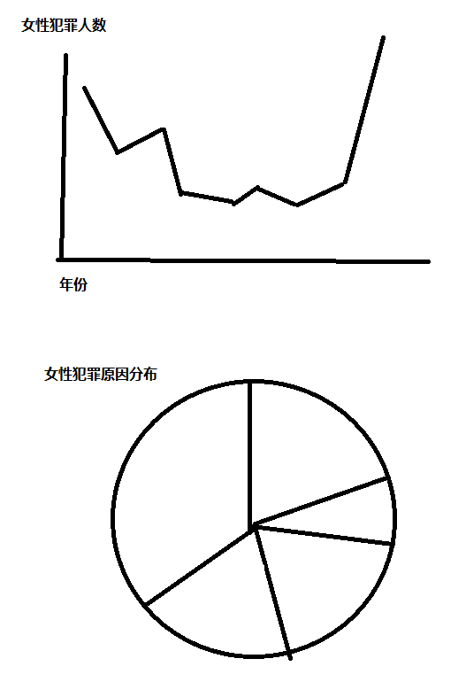

# 澳门雅思回忆

8.20日凯风电脑公司考试~

我男朋友被拒考了！因为他注册的生日写错了！所以一定要看清楚信息，每一个信息都不能错！不然就会悲剧！！！！

# 1. 口语

感觉是意大利考官,男，他很累，说话有点听不清楚。感觉要睡着了，所以考试的过程感觉并不好，感觉我听不太清楚他说话，他也就是公式性的问问题。我期间有好几次询问能否speak again~

不过！这个考官给了我很高分！我没想到我能6.5！原来想着只有6左右...因为有两个问题我没听清楚，但是我又不想再让他speak again了，就大致把我听到的部分回答了一下~

## 1.1 考题回顾

因为是机考，所以没有查passport的环节，直接就是考官自我介绍，然后说这里是雅思考试，接下来开始考试！

### Part 1

- 你是什么名字

- 我该怎么称呼你

- 你喜欢住在房子还是公寓

- 为什么喜欢住在房子

- 你喜欢住在大城市还是小城市

- 你为什么想住在这里

- 你每天是怎么安排的，daily routine

- Is it easy to manage time for you?

- 你最喜欢你房间的哪个地方

- 你为什么喜欢那个地方？

可能还有，不过记不清楚了

### Part 2

描述一个安静的地方

You should say: 

-  Where it is 

- How you knew it 

- How often you go there

- What you do there

- And explain how you feel about the place

### Part 3

- 约朋友见面的地方

- 你喜欢在哪里见你朋友

- 你喜欢呆在安静的地方还是热闹的地方

- 你为什么喜欢安静的地方

- 你认为老年人会比年轻人更喜欢爱安静的地方吗

- 你认为和邻居打好关系重要吗

- 为什么重要

## 1.2 口语总结

- 不要害怕要求speak again

- 一定要有肢体语言

- 因为我每个问题回答的不是特别长，所以我的口语问了很多

- 我能明显感觉面试官问了我不同主题的问题，因为我每个问题没有回答很长

- 如果不是求高分(7分以上)的话，可以短一点，语速慢一点，回答的时候要尽量减少语法错误

# 2. 听力

我听力没有特别的单项练习，我考前复习也基本上就是刷模拟题，刷题完后看自己错在哪里。听力成绩基本和平常模考一致，稍微低了一点。

## 2.1 听力回顾

听力不太记得了，但是part1, part4感觉比平常难一点，part2,part3简单

## 2.2 听力技巧总结

- 每次听完一个part之后，不要检查，直接跳转到下一个part读题

- 所有听力完成之后，再检查听力答案！
  - 其实重点看part1, part4即可，拼写是否有错误
  - part2, part3没听到，蒙也要填上

# 3. 阅读

阅读我感觉不难，没有平常模考难，不过考试状态不佳，不过没想到考了7分。

## 3.1 考题回顾

第一篇：好像是将一种农作物，这一篇比较难，忘了。

第二篇：海洋生物的眼睛，介绍各种海洋生物，然后海洋生物的眼睛机制，有一些鱼可以看到人看不到的颜色，有一些鱼用灯光来求偶，有一些鱼用灯光来防御

第三篇：一本小说，一个国王因为和苏格兰错误战略合作，然后从国王变成阶下囚的逃亡经历，然后把自己的故事经历，告诉了一个作者，写成了一本小说

## 3.2 阅读总结

- 阅读总体还行，不过在难度设置上和平常不一样

- 之前的题目都是第一篇简单，但是这次第一篇我觉得是最难的

- 第二篇阅读比较简单，所以我第一篇看着快到20分钟了，但是做的蒙蒙的就直接跳到第二篇了

- 把后面走完之后，最后再看得第一篇

- 每篇阅读一定要认真做填词题！因为填词题相对简单，而且蒙不了！

- 选择匹配这些实在不行还能蒙，排除法，比较法，反正不要空！

# 4. 写作

我的写作练习的不多，完整的把simon的网课听完了！然后在考前跟着simon的模板练习作文

## 4.1 作文题目回顾

### Part 1

作文一，组合图，简单

下图描述了一个欧洲国家女性犯罪在1***年到1***年的变化

### Part 2

政府是不是应该替学生支付大学费用

The government should pay for the course fees for students who study at the University. To what extent do you agree or disagree?

## 4.2 写作总结

写作时作文二比作文一的分数高很多！

因此送考试的时候是先写了作文二，再写的作文一

- 作文二耗时（25-30min左右）

- 作文一耗时（20min左右）

- 最后我记得剩下10几分钟仔细检查每篇作文的拼写！